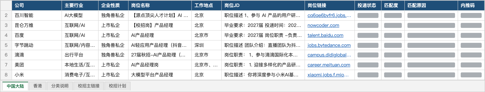
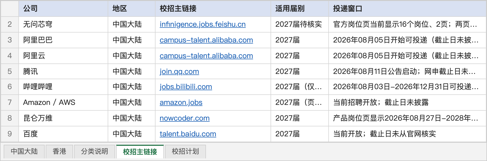
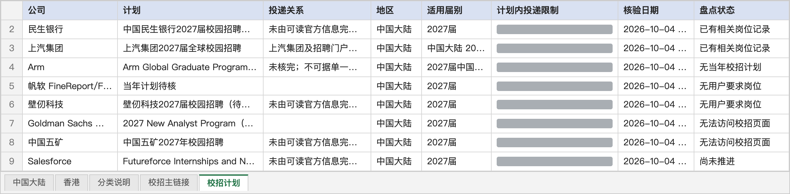
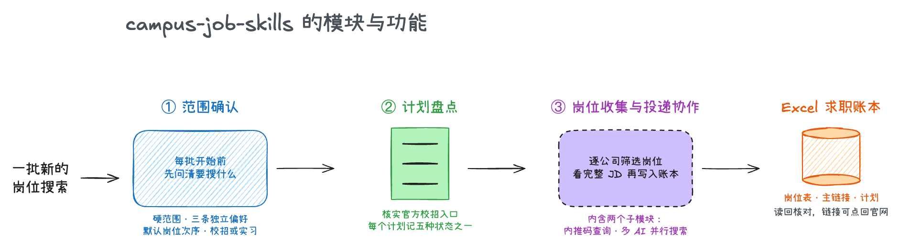
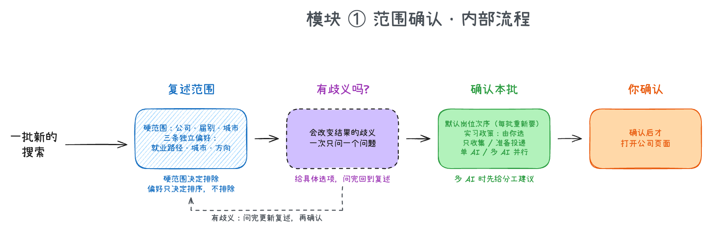
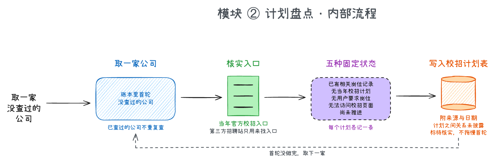
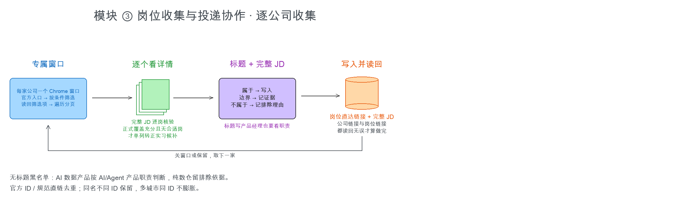
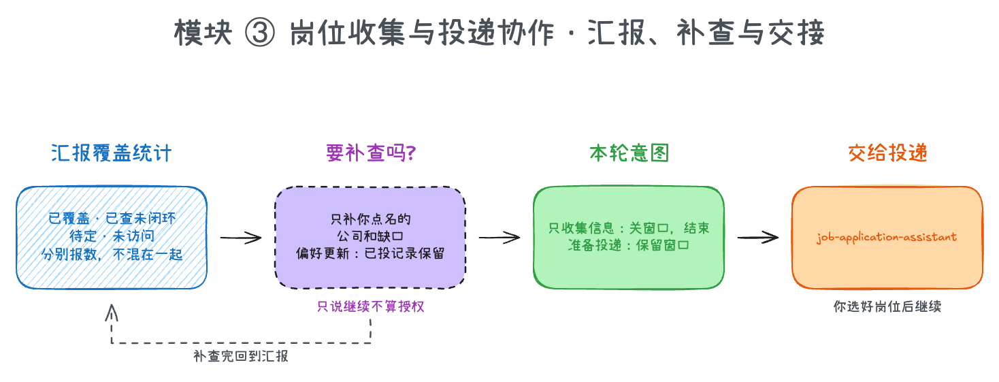
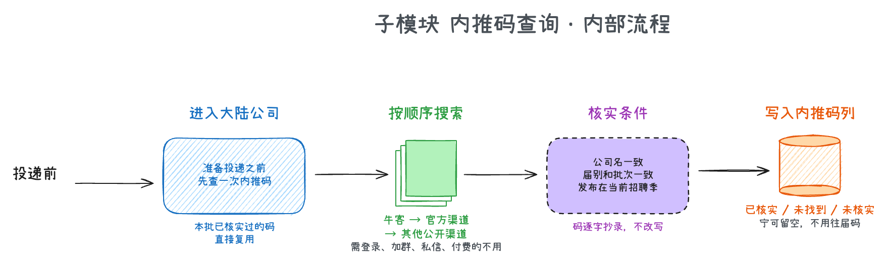
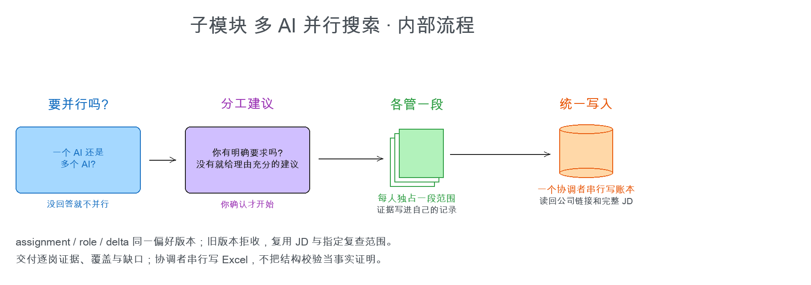

# campus-job-skills

2022 年,我刚刚进入社会,那一年我投了 70 个简历,最后拿了 10 个 offer。人们都在说"工作不好找"。2026 年,我再次回到校招,发现没有 200-300 次简历投递,很难找到同样的机会;而找工作、投简历本身,就是非常麻烦且复杂的事情。因此,我做了这个。

这是一组给 AI 助手使用的技能包(Skill),面向**中国大陆的校招和实习**。装进 Claude Code、Codex 这类能在你电脑上干活的 AI 工具后,它会按固定流程帮你逐家公司收集岗位,整理进一份 Excel 求职账本。选好岗位之后,可以接着交给 [`job-application-assistant`](https://github.com/SilentLake-Tech-SkillHub/job-application-assistant) 去填表投递。

它能帮你:

- **先问清再动手**:每一批开始前,和你确认看哪些公司、哪类岗位、哪些城市,是校招还是实习。有歧义就一次问一个问题,不会搜回一堆不相干的岗位。
- **找到真正的校招入口**:逐家公司核实官方校招页面,分清正式批、实习和专项计划,不用再一家家自己翻官网。
- **按 JD 筛岗位**:不只看标题。标题没写"产品经理"但职责就是产品的会纳入,标题写了但实际是运营的会排除。
- **写进 Excel 并核对**:每个岗位的直达链接和完整 JD 都写入账本,写完立刻读回核对。
- **查内推码**:大陆公司在投递前,先到牛客等公开渠道查当前届别有效的内推码,查到并核实了才记录。
- **标出实习转正机会**:正式批次里,官方明确写了"转正"的实习会单独标注。
- **多个 AI 并行**(可选):公司很多时,经你同意可以分给多个 AI 同时搜,再统一写入账本。

所有最终提交都由你本人确认,它不会替你点"提交"。

## 最终成品是什么?

你得到的是一份 Excel 求职账本。每家公司、每个计划、每个岗位都有一行记录,而且每一条都能点回官方页面核对。

| 产物 | 里面是什么 | 什么时候用 |
|---|---|---|
| **岗位表**(中国大陆、香港各一张) | 每个岗位一行:公司、行业、企业性质、岗位名称、工作地点、完整 JD、所属 BU、直达链接、投递状态、匹配度与原因、校招冷静期、内推码 | 挑要投的岗位、按匹配度排优先级 |
| **校招主链接** | 每家公司一条官方校招入口,以及适用届别和投递窗口 | 快速回到某家公司的官方校招页 |
| **校招计划** | 每家公司的各个计划(正式批、实习、专项计划),各自记录五种固定状态之一 | 看哪些公司已经查过、结论是什么 |

**岗位表**:直达链接和完整 JD 都在,个人判断的列(投递状态、匹配度、匹配原因、内推码)属于你自己。



**校招主链接**:每家公司的官方校招页,加上适用届别和投递窗口。官方没披露截止日期的,如实写"截止日未披露",不会替它编一个。



**校招计划**:每个计划只用五种状态之一:已有相关岗位记录、无当年校招计划、无用户要求岗位、无法访问校招页面、尚未推进。具体原因写在备注里,不另造状态。



想先看看账本长什么样,可以直接打开 [`samples/internet-product-job-search-sample.xlsx`](samples/internet-product-job-search-sample.xlsx)。这是一份互联网产品岗位搜索的样例,只保留了公司名单(大陆 152 家、香港 41 家)及其行业和企业性质,岗位、链接、投递状态等都是空的,直接就能拿来当你自己的起点。

## 模块与流程

这组 Skill 由三个模块组成,按顺序工作:先问清要搜什么,再盘点每家公司的校招计划,最后逐公司收集岗位、写进账本。岗位收集这个模块里还包含两个子模块:查内推码、多个 AI 并行搜索。



下面先讲每个模块做什么、内部怎么走,再讲两个子模块。

### 模块 ① 范围确认

**它做什么:** 每一批开始前,把"这一批要搜什么"问清楚,你确认了才开始翻网页。



AI 先把它理解的范围复述给你:哪些公司、哪类岗位、排除什么、校招还是实习、哪些城市。岗位族会分开看,产品经理、AI 产品、产品运营、用户研究、数据分析各是各的,不会因为名字像就混在一起。

只要有一处歧义会改变搜索结果,它就问你,而且一次只问一个问题、给出具体选项,问完更新复述。你确认之后,它再问清三件事:这一批是校招、实习还是两者都要;只收集信息,还是准备投递;由一个 AI 做,还是多个 AI 并行。你没确认之前,它不会打开任何公司的页面。

### 模块 ② 计划盘点

**它做什么:** 对账本里每一家公司,找到当年的官方校招入口,弄清楚它有哪些计划,并给每个计划记一个状态。



AI 从账本里取一家首轮还没查过的公司,先核实当年的官方校招入口。一家公司往往有好几个计划:正式批、实习、专项计划,所以每个计划单独记一行,并附上来源和核验日期。第三方招聘网站只用来帮你找入口,不作为最终依据。

每个计划只会落在五种状态之一,在上面的截图里都能看到。这一轮没做完就继续取下一家,做过的公司不会重复查;计划之间的关系官方没说明的,就标"待核实",不会为了弄清楚而拖慢整批。

### 模块 ③ 岗位收集与投递协作

**它做什么:** 逐家公司筛选岗位,用完整 JD 判断是否纳入,把直达链接和 JD 写进账本并读回核对,最后汇报覆盖情况、补查缺口,再把选好的岗位交给投递。这个模块有两张图:逐公司收集,和汇报、补查与交接。



每家公司单独开一个 Chrome 窗口。AI 在官方入口按你确认的条件筛选,筛完把选中的条件读回来核对一遍,再翻完所有分页,每个岗位都在独立的标签页里打开详情。

判断一个岗位要不要收,看的是标题加完整 JD:属于目标岗位的就写入,拿不准的把证据记下来,不属于的记下排除理由。正式批次里,官方明确写了"转正机会"的实习,会标成"实习转正候选";普通实习不收。写入时每个岗位的直达链接和完整 JD 都进账本,公司的官方链接和岗位链接读回无误,才算这家公司做完。大陆公司在这一步会调用下面的内推码子模块。



首轮把名单跑完后,AI 会分开报数:已覆盖、已查但没闭环、待定、还没访问,不会混成一个"完成了多少"。你想补查哪几家、哪个缺口,点名之后它才去补,只说一句"继续"不算授权。

最后看你这一批的目的:只收集信息的,关掉它自己开的窗口,结束;准备投递的,保留窗口,等你选岗,然后交给 [`job-application-assistant`](https://github.com/SilentLake-Tech-SkillHub/job-application-assistant) 去填表。

### 子模块:内推码查询

**它做什么:** 大陆公司的内推码能让简历进入员工推荐通道,但网上流传的码混着往届、过期和其他岗位类别的。这个子模块在投递之前查一次,只留下能证明适用于当前批次的码。



进入一家大陆公司、打开申请表之前,AI 先查一次。本批已经核实过的码直接复用,不重复搜索。搜索按顺序来:牛客优先,其次公司官方渠道,再其次其他公开渠道;需要登录、加群、私信或付费才能拿到的码不用。

一个码要同时满足才写入:帖子写明的公司名一致,届别和批次一致,发布在当前招聘季,有效期和适用岗位也要覆盖要投的岗位,码的原文逐字抄录。不满足就写"未找到"或"未核实",宁可留空,也不用往届码。结果写进该公司所有岗位行的"内推码"列。

### 子模块:多个 AI 并行搜索

**它做什么:** 公司很多时,经你同意把搜索分给多个 AI 同时做,最后统一写入账本。



它先问你是一个 AI 还是多个;你没回答,就不并行。选了多个之后,它会问你对人数、分工、优先级、时间有没有明确要求;没有明确要求,就给你一份理由充分的分工建议,你确认了才开始。每个 AI 各管一段独占的范围,把查到的证据写进自己的记录;最后由一个协调者按顺序统一写入账本,并读回公司链接和完整 JD。这样避免多个 AI 同时改同一个 Excel 文件。

## 我应该准备什么材料?

1. **建一个求职工作目录**,放进你的 Excel 求职账本和简历文件夹。没有账本的话,可以从 `samples/` 里那份样例开始。
2. **把五个 Skill 目录复制到 AI 助手的 Skill 目录**(见下一节)。
3. **建求职配置**:按 `【校招岗位收集与投递】campus-job-application/references/profile-template.md` 在工作目录建立 `产品管理/求职配置.md`,填入账本、地区表、目标届别、岗位方向、简历位置。Skill 本身不含任何个人取值,全部从这份配置读;缺失时 AI 会先问你再创建。

然后对 AI 说一句"开始新一批校招信息收集"就行。

## 我可以在哪些工具上使用?

有三种用法,按推荐程度从高到低排列。

### 用法一(最推荐): Codex /  Claude Code + computer use

这是效果最好的一种。把推理强度开到 medium,再打开 computer use(让 AI 直接操作你的电脑和浏览器),除了验证码之外,收集岗位的整套操作它都能帮你做:开官网、筛选、翻页、读 JD、写 Excel。需要本机装有 Chrome。

**推荐:让 AI 帮你安装。** 把这个仓库交给 AI,说"帮我把这些 Skill 装好"。

**手动安装:**

| 工具 | 复制到 | 装好后的完整路径示例 |
|---|---|---|
| Claude Code | 用户目录 `~/.claude/skills/` | `~/.claude/skills/campus-job-application/SKILL.md` |
| Codex | 用户目录 `~/.codex/skills/`(或项目里的 `.agents/skills/`) | `~/.codex/skills/campus-job-application/SKILL.md` |

目录名开头的【中文】只是方便浏览用途,可以原样保留,AI 按 `SKILL.md` 里的 `name` 识别。两个子 Skill(并行搜索、内推码)已经放在 `campus-job-application` 目录里,跟着一起复制即可。

### 用法二: Cue /  OpenAI Dots,直接挂给个人 Agent

把 Skill 直接挂到你的个人 Agent 上,它做一个、向你汇报一个。适合不想盯着屏幕、只想看进度汇报的人。

### 用法三(可以用,但不推荐): Kimi /  GLM +  Browser use /  Playwright

用 Kimi、GLM 这类模型,搭配 Browser use 或 Playwright 来操作浏览器,也能跑通。但不推荐:这类组合有时识别网页元素不准,模型本身的能力也不强,所以它写进账本的内容,你要多检查几遍。

## 使用技巧

**怎么指挥 AI**

- **开新一批**:说"开始新一批校招信息收集",它会先走模块 ① 向你确认范围。每一批的选择只对这一批有效,下一批会重新确认。
- **只收集,还是要投递**:在模块 ① 里选。只收集会在查完后关掉窗口;准备投递会保留窗口,方便你接着选岗。
- **公司很多时用多 AI**:模块 ① 选"多个 AI"后,它会先给你一份分工建议(谁负责哪些公司),你确认了才开始,最后由一个 AI 统一写入账本,避免多人同时改一个文件。
- **补查缺口**:首轮汇报后,直接点名"把 XX 公司的实习计划再查一下",它只补你点的部分。

**每类产物怎么用**

- **岗位表**:按"匹配度"从高到低排序挑岗位;匹配度是 0 到 100 的相对优先级,依据是岗位 JD 和你确认的当前简历。
- **校招主链接**:想回某家公司官方页面时,直接点链接。
- **校招计划**:筛"尚未推进"和"无法访问校招页面",就是还需要你关注的公司。
- **同一家公司的岗位**会集中放在一起,按开始时间从近到远排;已过期或待核验的岗位保留行并在备注里写明,不会悄悄删掉。

## FAQ

**只能做互联网产品岗吗?** 不是。岗位族、公司、城市都由你在模块 ① 里确认,样例只是拿互联网产品岗做演示。

**能做港澳和海外吗?** 账本里有香港这张表,收集流程相同。内推码这一步默认只对中国大陆公司做,其他地区除非你明确要求。

**内推码从哪里来?** 优先牛客,其次公司官方渠道,再其次其他公开渠道。需要登录、加群、私信或付费才能拿到的不用;也只记录能证明适用于当前届别的。

**它会替我投简历吗?** 不会。这组 Skill 只做到收集和整理。要填表投递,用 [`job-application-assistant`](https://github.com/SilentLake-Tech-SkillHub/job-application-assistant),并且最终提交仍然需要你逐个确认。

**我的个人信息会进仓库吗?** 不会。账本、简历路径、目标届别这些都在你自己的工作目录里,Skill 里不带任何个人取值。

**边界:** 这组 Skill 只认官方校招页面;不保存密码、Cookie、验证码或证件信息;需要登录的地方由你本人完成;官方没披露的信息(比如截止日期)不会替官方编。

## 附录:文件结构

```text
campus-job-skills/
├── README.md
├── docs/
│   ├── images/                         README 里的账本截图
│   └── flow/                           模块总览图、各模块与子模块的内部流程图
├── samples/
│   └── internet-product-job-search-sample.xlsx   互联网产品搜索的样例账本
├── 【校招批次范围确认】campus-job-preference-intake/
│   └── SKILL.md                        模块 ①:确认范围、本轮意图、搜索方式
├── 【校招计划盘点】campus-job-plan-inventory/
│   └── SKILL.md                        模块 ②:核实官方入口,盘点各计划
└── 【校招岗位收集与投递】campus-job-application/
    ├── SKILL.md                        模块 ③:逐公司收集岗位,汇报与补查
    ├── agents/openai.yaml
    ├── references/
    │   ├── profile-template.md         求职配置模板
    │   ├── workbook-schema.md          账本的表结构与取值
    │   ├── browser-and-submission-gates.md   浏览器与提交的门禁
    │   └── research-progress.md        研究进度与覆盖核对
    ├── scripts/validate_research_progress.py
    └── skills/
        ├── campus-job-parallel-search/ 多个 AI 并行搜索的协作
        └── campus-job-referral-code/   内推码的查询与核实
```

本仓库由 [SilentLake-Tech-SkillHub](https://github.com/SilentLake-Tech-SkillHub) 维护。
